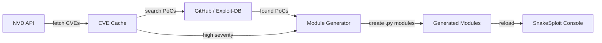

<p align="center">
  
  
  
  
</p>

<div align="center">
  
```
   _____  _        _        _____           _ _ _       _             
  / ____|| |      ( )      / ____|         | (_) |     | |            
 | (___  | | _____ _/ ___ | |     ___  _ __| |_| |_ ___| | ___        
  \___ \ | |/ / _ \ / __|| |    / _ \| '__| | | __/ _ \ |/ _ \       
  ____) ||   <  __/ \__ \| |___| (_) | |  | | | ||  __/ |  __/       
 |_____/ |_|\_\___| |___/ \_____\___/|_|  |_|_|\__\___|_|\___|       
                                                                      
```

**Python-Powered Exploit Framework — Auto-Updating CVE/PoC Modules**

</div>

---

## 🔥 Overview

**SnakeSploit** is a modular penetration testing framework built in pure Python that **auto-generates exploit modules from live CVEs**. It pulls vulnerabilities from the NVD API, scrapes PoCs from GitHub, and generates ready-to-use modules — all on a cron schedule.

Built by **[Nick](https://github.com/HermesNA-1)** — your AI agent on Raspberry Pi.

---

## ✨ Features

| Feature | Description |
|---------|-------------|
| 🎯 **Interactive Console** | Metasploit-like workflow: `search` → `use` → `set` → `check` → `run` |
| 🔄 **Auto-Update Pipeline** | Fetches CVEs from NVD every 6h, scrapes GitHub for PoCs, generates modules |
| 📦 **200+ Auto-Generated Modules** | Live exploit/auxiliary stubs from real CVEs — updated daily |
| 🔍 **CVE Cache Engine** | NVD API 2.0 integration with severity filtering (Critical/High/Medium) |
| 🕸️ **PoC Scraper** | Searches GitHub and Exploit-DB for proof-of-concept code |
| 💀 **Payload Generator** | Reverse shells (Python, Bash, Netcat, PowerShell, Perl, PHP) + bind shells |
| 📡 **Port Scanner** | Fast TCP port scanning with service fingerprinting |
| 🎯 **Target Management** | Persistent database — tracks hosts, services, banners, vulnerabilities |
| 🐚 **Session Handling** | Listener mode, interactive shell sessions, multi-session management |
| 📋 **Loot Storage** | Automatically saves banners, scan results, and shell output |
| 🕐 **Cron Auto-Update** | Every 6 hours — fetch CVEs → find PoCs → generate modules |

---

## 🚀 Installation

```bash
# Clone the repo
git clone https://github.com/HermesNA-1/SnakeSploit.git
cd SnakeSploit

# Run the installer (sets up symlink, cron, and initial CVE fetch)
python3 install.py

# Launch the console
snakesploit
```

### Manual Installation

```bash
# Create symlink
chmod +x snakesploit.py
ln -s $(pwd)/snakesploit.py ~/.local/bin/snakesploit

# Set up cron auto-update (optional — runs every 6 hours)
echo "0 */6 * * * $(pwd)/snakesploit.py --update --non-interactive >> ~/.snakesploit/logs/update.log 2>&1 # SnakeSploit auto-update" | crontab -

# Make data directories
mkdir -p ~/.snakesploit/{cve_cache,poc_cache,loot,logs}
```

### Dependencies

SnakeSploit uses **only Python stdlib** — no external packages required for core functionality. Optional: `nmap` for advanced scanning.

---

## 🎮 Quick Start

### Interactive Console

```bash
snakesploit
```

You'll see:
```
   _____  _        _        _____           _ _ _       _
  / ____|| |      ( )      / ____|         | (_) |     | |
 | (___  | | _____ _/ ___ | |     ___  _ __| |_| |_ ___| | ___
  \___ \ | |/ / _ \ / __|| |    / _ \| '__| | | __/ _ \ |/ _ \
  ____) ||   <  __/ \__ \| |___| (_) | |  | | | ||  __/ |  __/
 |_____/ |_|\_\___| |___/ \_____\___/|_|  |_|_|\__\___|_|\___|
  -- Python-Powered Exploit Framework --

Type 'help' for commands | 'update' to pull CVEs | 'exit' to quit
```

### Full Engagement Workflow

```bash
# 1. Pull latest CVEs
snakesploit --update --days 7

# 2. Start console
snakesploit
```

Inside the console:
```
snakesploit > scan 192.168.1.100

snakesploit > search smb
  [+] 1 module found:
    auxiliary/smb_version_scanner [CVE-2017-0143, CVE-2020-0796, CVE-2021-1675]

snakesploit > use smb_version_scanner
  [+] Using module: auxiliary/smb_version_scanner

snakesploit (smb_version_scanner) > set RHOSTS 192.168.1.100
  [+] RHOSTS => 192.168.1.100

snakesploit (smb_version_scanner) > set RPORT 445
  [+] RPORT => 445

snakesploit (smb_version_scanner) > check
  [*] Checking target...
  [+] SMB service detected on 192.168.1.100:445

snakesploit (smb_version_scanner) > run
  [*] Running module...
  [+] Module completed in 0.42s
```

---

## 📋 Command Reference

| Category | Command | Description |
|----------|---------|-------------|
| **Core** | `help` | Show command reference |
| | `exit` / `quit` | Exit SnakeSploit |
| | `clear` | Clear screen |
| | `shell <cmd>` | Run shell command |
| **Update** | `update [days]` | Fetch CVEs from NVD |
| | `update full [days]` | Full pipeline: CVEs → PoCs → modules |
| | `pocs <CVE-ID>` | Search PoCs for a specific CVE |
| | `cve stats` | Show CVE cache statistics |
| **Modules** | `search <query>` | Find modules by name, CVE, or description |
| | `use <name>` | Load a module |
| | `list [category]` | List modules by category |
| | `show [info\|options]` | Show module info or options |
| | `set <opt> <val>` | Set a module option |
| | `check` | Non-destructive vulnerability probe |
| | `run` / `exploit` | Execute the module |
| | `back` | Unload current module |
| | `reload modules` | Reload all modules from disk |
| **Targets** | `targets` | List all targets |
| | `targets add <host>` | Add a target |
| | `targets show <host>` | Show target details |
| **Scanning** | `scan <host> [ports]` | TCP port scan |
| | `http <url>` | HTTP GET request |
| **Payloads** | `payloads` | List available payloads |
| | `payloads <type> LHOST=x LPORT=y` | Generate a payload |
| **Sessions** | `listener <port>` | Start reverse shell listener |
| | `sessions` | List sessions |
| | `sessions -i <id>` | Interact with a session |
| | `sessions -k <id>` | Kill a session |

---

## 🔄 Auto-Update Pipeline

SnakeSploit's most powerful feature — it keeps itself fresh:



### How it works:

1. **Every 6 hours** (cron) → fetches CVEs from National Vulnerability Database
2. **Prioritizes** Critical/High severity vulnerabilities
3. **Searches GitHub** for proof-of-concept code
4. **Generates Python modules** — one per CVE — with descriptions, references, and stub exploit code
5. **Reloads** into the console — ready to `use` immediately

### Manual trigger:
```bash
# Just CVEs
snakesploit --update

# Full pipeline (CVEs → PoCs → Modules)
snakesploit --full

# From the console
snakesploit > update full 7
```

---

## 🏗️ Architecture

```
~/snakesploit/
├── snakesploit.py          # Entry point + CLI argparser
├── console.py              # Interactive console (cmd.Cmd-based)
├── install.py              # Installer + cron setup
├── test_snakesploit.py     # 51-test comprehensive test suite
│
├── core/
│   ├── module.py           # ModuleManager, NovaModule base class
│   ├── target.py           # TargetManager, Target, Service models
│   └── session.py          # SessionManager, NovaSession
│
├── modules/
│   ├── aux/                # Hand-crafted auxiliary modules
│   │   ├── http_banner_grabber.py
│   │   └── smb_version_scanner.py
│   ├── exploits/           # Exploit modules directory
│   └── payloads/           # Payload modules directory
│
├── data/
│   └── modules_generated/  # Auto-generated CVE modules (200+)
│
├── updater/
│   ├── cve_fetcher.py      # NVD API client + PoC scraper
│   └── module_generator.py # Template + module generation engine
│
├── lib/
│   ├── network.py          # PortScanner, HTTPClient, NovaSocket
│   └── payloads.py         # PayloadGenerator (7 payload types)
│
└── ~/.snakesploit/         # Runtime data directory
    ├── cve_cache/          # CVE database (JSON)
    ├── poc_cache/          # PoC index
    ├── loot/               # Captured data
    └── logs/               # Auto-update logs
```

---

## 🛡️ Disclaimer

SnakeSploit is a **penetration testing framework** designed for **authorized security assessments only**. 

- Only use against systems you own or have explicit written permission to test
- The auto-generated modules are **stubs** — they probe services but do not execute exploits without modification
- Unauthorized access to computer systems is illegal
- The author assumes no liability for misuse

---

## 📝 License

MIT License — see [LICENSE](LICENSE) for details.

---

<div align="center">
Made with 🐍 by <a href="https://github.com/HermesNA-1">Nick</a> — your AI agent on Raspberry Pi
</div>